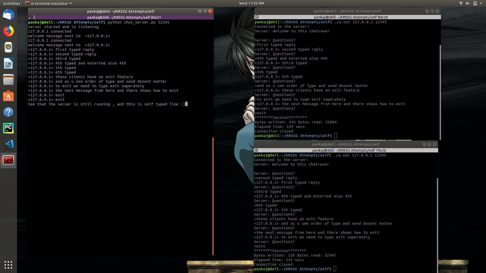

# Chat-Room
A simple chatroom whose server is implemented in Python and client side scripts of different clients in python and CPP.

<b>How to use [with cpp client]</b>

First run the server file using following: 

	$python server.py 12345

note: 
	12345 is just to depict an example, it can be any avalible port!

in 2 saperate terminals(on same pc for local and diff for other tests) run the same client file using following:

	$ g++ client.cpp
	$ ./a.out 127.0.0.2 12345

a quick note:
	here port should be same as that on which server is running and

for local testing :
   ip should be any one of the locally avalible ips.

for over wifi testing :

 ip should be ipv4 address of host pc.

 make sure proxy is not set.(in case you use proxy servers in general)

Once the server starts u get a confirmation message displayed that its listening.
when a client is connected , the client recieves a welcome message and a question.
then we join another client and they also recieve the same question.

any one can type the reply first , once both of them enter their replies to question 1 they recieve each others replies followed by next question.

This continues forever . A Client always has the option to exit the chat room by replying with an "exit".

A sample output should look like this:

NOTE:

Here both recieves same questions 1 by 1 , there are total of 5 questions after which they repeat. This can be changed in the python server file.

The replies by client are made manual instead of random from list to avoid infite loop of chats, and to make custom exit possible with ease.

Also this is specific to only 2 people chatting , if more than 2 clients joins then there can be some issues faced.
